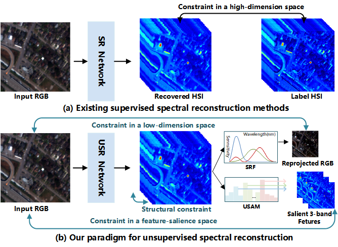

# Uncertainty-guided Discriminative Priors Mining for Flexible Unsupervised Spectral Reconstruction
 [Yihong Leng](https://scholar.google.com/citations?user=eBel2B8AAAAJ&hl=en&oi=ao), [Jiaojiao Li](https://scholar.google.com/citations?user=Ccu3-acAAAAJ&hl=zh-CN&oi=ao),  [Rui Song](https://scholar.google.com/citations?user=_SKooBYAAAAJ&hl=zh-CN&oi=sra), [Yunsong Li](), and [Qian Du]() 

⭐ Our work has been accepted by IEEE Transactions on Neural Networks and Learning Systems.⭐

<hr />

> **Abstract:** Existing supervised spectral reconstruction (SR) methods adopt paired RGB images and hyperspectral images (HSIs) to drive the overall paradigms. Nonetheless, in practice, ``paired'' requires higher device requirements like specific well-calibrated dual cameras or more complex and exact registration processes among images with different time phases, widths, and spatial resolution. To tackle the above challenges, we propose a flexible uncertainty-aware unsupervised SR paradigm, which dynamically establishes the forceful and potent constraints with RGBs for driving unsupervised learning. As a specific plug-and-play tail in our paradigm, the Uncertainty-aware Saliency Alignment Module (USAM) calculates pixel- and spectral-wise information entropy for uncertainty estimation, which attempts to represent the corresponding reflectivity or radiance to the light among different objects in various scenes, forcing the paradigm to adaptively explore the scene-agnostic prominent features.
> Furthermore, a progressively parallel network under our unsupervised paradigm is conducted to excavate discriminate structural and semantic priors of RGBs to assist in recovering dependable HSIs:
>
> 1) A Learnable Rank guided Structural Representation (LRSR) flow is leveraged to characterize the latent structural priors via excavating nonzero elements in the full-rank matrix and further preserve evident boundaries in HSIs.
> 2) A Coarse-to-Fine Band-wise Semantic Perception (CBSP) flow is conducted to propagate perceptual band-wise affinity for aggregating and strengthening intrinsic inter-band dependencies, and further extract delicate semantic priors, which can recover plentiful contiguous spectral information in HSIs.
> Comprehensive quantitative and qualitative experimental results on three visual and two remote sensing benchmarks have shown the superiority and robustness of our method. 
>
> We also conducted nine existing SR methods in our unsupervised paradigm to recover HSIs without any manual intervention, which proves the generality of our paradigm to some extent.
<hr />

## Task Introduction




## Our UnSSR Framework


## LRSR


## CBSP


## Interesting visualization 


## How to Besign

We propose a framework for unsupervised hyperspectral reconstruction. You can carry any SOTA reconstruction network to achieve an unsupervised spectral reconstruction. We are going to enlarge our model zoo in the future. The support list is as follows:

<details open>
<summary><b>Supported algorithms:</b></summary>

* [x] [LTRN](https://github.com/renweidian/LTRN) (Tnnls 2024)

* [x] [SPECAT](https://github.com/THU-luvision/SPECAT) (CVPR 2024)
* [x] [MFormer](https://github.com/SuperiorLeo/MFormer-Taming-Masked-Transformer-for-Unsupervised-Spectral-Reconstruction)(TGRS 2023)
* [x] [SAUNet](https://github.com/hustvl/SAUNet) (ACM 2023)
* [x] [HDNet](https://arxiv.org/abs/2111.07910) (CVPR 2022)
* [x] [Restormer](https://github.com/swz30/Restormer) (CVPR2022)
* [x] [MST++](https://arxiv.org/abs/2111.07910) (CVPRW 2022)
* [x] [DRCR](https://ieeexplore.ieee.org/document/9857076/) (CVPRW 2022)
* [x] [MST](https://arxiv.org/abs/2111.07910) (CVPR 2022)
* [x] [AWAN](https://arxiv.org/abs/2005.09305) (CVPRW 2020)
* [x] [HRNet](https://arxiv.org/abs/2005.04703) (CVPRW 2020)
* [x] [SUSR](https://ieeexplore.ieee.org/document/9710095/) (ICCV 2019)


## Train
#### 1. **Created Environment.**

- anaconda NVIDIA GPU

- torch-1.9.0+cu111-cp37-cp37m-linux_x86_64

- torchvision-0.10.0+cu111-cp37-cp37m-linux_x86_64

- ```shell
  # next
  pip list --format=freeze > requirements.txt
  ```

#### 2. Download the dataset.

- Download the training spectral images ([Google Drive](https://drive.google.com/file/d/1FQBfDd248dCKClR-BpX5V2drSbeyhKcq/view))
- Download the training RGB images ([Google Drive](https://drive.google.com/file/d/1A4GUXhVc5k5d_79gNvokEtVPG290qVkd/view))
- Download  the validation spectral images ([Google Drive](https://drive.google.com/file/d/12QY8LHab3gzljZc3V6UyHgBee48wh9un/view))
- Download the validation RGB images ([Google Drive](https://drive.google.com/file/d/19vBR_8Il1qcaEZsK42aGfvg5lCuvLh1A/view))

#### 3. Data Preprocess.

Please refer  to our latest work [MFormer](https://github.com/SuperiorLeo/MFormer-Taming-Masked-Transformer-for-Unsupervised-Spectral-Reconstruction) to prepare datasets. 

#### 4. Training.

```shell
python main.py
```
The data generated during training will be recorded in `/results/`.
## Test
```shell
python test_model1_cave.py
```
- Our trainable parameters have been put in the fold ''pth''. Note that the validation HSIs are as follows:
- balloons_ms.mat egyptian_statue_ms.mat fake_and_real_lemons_ms.mat fake_and_real_tomatoes_ms.mat real_and_fake_apples_ms.mat
- thread_spools_ms.mat clay_ms fake_and_real_beers_ms fake_and_real_peppers_ms hairs_ms real_and_fake_peppers_ms stuffed_toys_ms


## Citation
If you find this code helpful, please kindly cite:
```shell
# If the whole unsupervised SR can be leveraged, call it UnSSR.
# If the network is helpful, call it SFFormer.
@ARTICLE{UnSSR,
  author={Leng, Yihong and Li, Jiaojiao and Song, Rui and Li, Yunsong and Du, Qian},
  journal={IEEE Transactions on Neural Networks and Learning Systems}, 
  title={Uncertainty-Guided Discriminative Priors Mining for Flexible Unsupervised Spectral Reconstruction}, 
  year={2025},
  volume={},
  number={},
  pages={1-14},
  keywords={Image reconstruction;Semantics;Spatial resolution;Robustness;Hyperspectral imaging;Feature extraction;Excavation;Visualization;Uncertainty;Narrowband;Rank;semantic priors;spectral reconstruction (SR);structural representation;uncertainty;unsupervised learning},
  doi={10.1109/TNNLS.2025.3526159}}


# MFormer
@ARTICLE{MFormer,
  author={Li, Jiaojiao and Leng, Yihong and Song, Rui and Liu, Wei and Li, Yunsong and Du, Qian},
  journal={IEEE Transactions on Geoscience and Remote Sensing}, 
  title={MFormer: Taming Masked Transformer for Unsupervised Spectral Reconstruction}, 
  year={2023},
  volume={61},
  number={},
  pages={1-12},
  doi={10.1109/TGRS.2023.3264976}}

```
